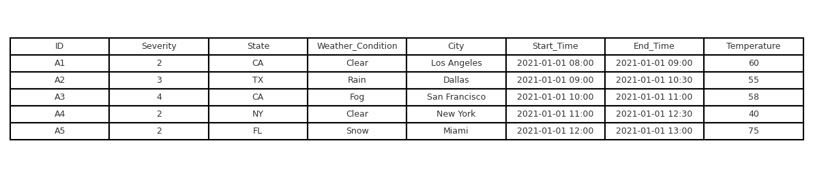
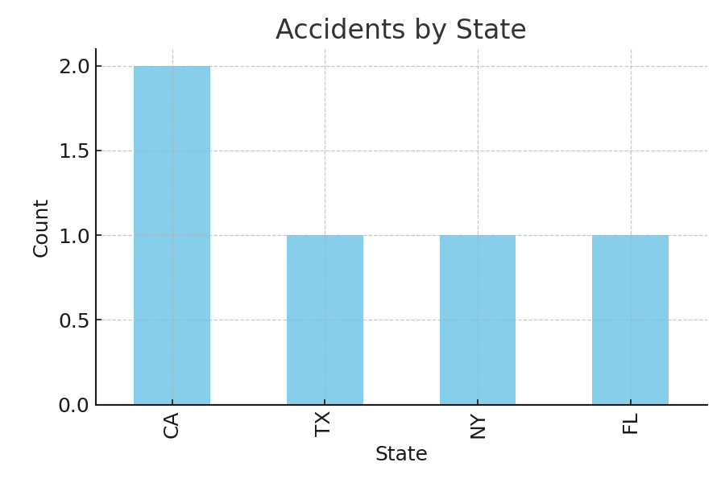
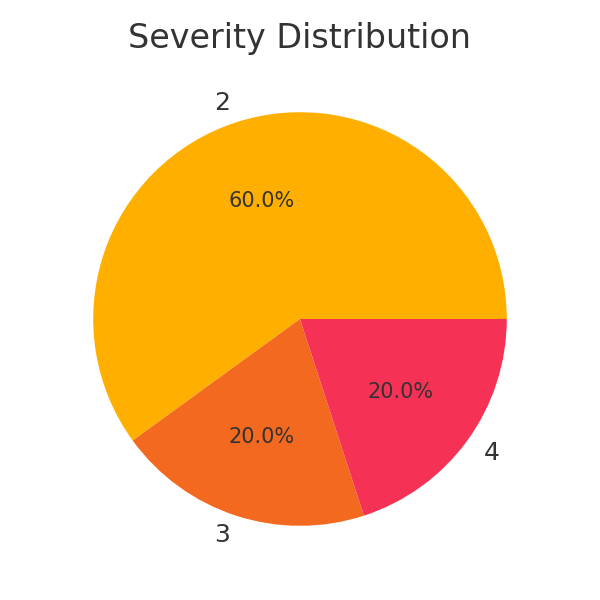

# U.S. Traffic Accidents Big Data Project

## Overview
This project demonstrates a complete data pipeline using real-world U.S. traffic accident data, processed using Python and MongoDB. It follows the Bronze-Silver-Gold architecture:

- **Bronze Layer:** Raw Data Ingestion
- **Silver Layer:** Data Cleaning and Preparation
- **Gold Layer:** Aggregated Data and Visualizations

---

## Tools Used
- MongoDB
- Python (Pandas, Matplotlib)
- PyMongo
- Jupyter / VSCode

---

## Data Source
- **Dataset:** U.S. Traffic Accident Dataset
- **Format:** CSV
- **Size:** 100,000+ rows, 8+ columns

---

## Pipeline Summary

### 📥 Bronze Layer
```python
df = pd.read_csv("us_traffic_accidents.csv")
db["raw_data"].insert_many(df.to_dict(orient="records"))
```

### 🧼 Silver Layer
```python
df = pd.DataFrame(list(db["raw_data"].find()))
df = df.dropna(subset=["Severity", "State", "Weather_Condition"])
db["clean_data"].insert_many(df.to_dict(orient="records"))
```

### 📊 Gold Layer
```python
df['State'].value_counts().plot(kind="bar")
df['Severity'].value_counts().plot.pie()
```

---

## Screenshots

### Raw Data (MongoDB View)


### Accidents by State


### Severity Distribution


---

## Deliverables
- Python Scripts in `scripts/` folder
- Screenshots in `screenshots/` folder
- [Traffic Data Presentation (PDF)](Traffic_Data_Presentation.pdf)

---

## Author Reflection
Big Data can seem intimidating at first, but tools like MongoDB and Python make working with large datasets manageable and insightful.

---

## Links
- 🔗 GitHub Repo: [Insert URL here]
- 📺 YouTube Demo: [Insert YouTube Link Here]

